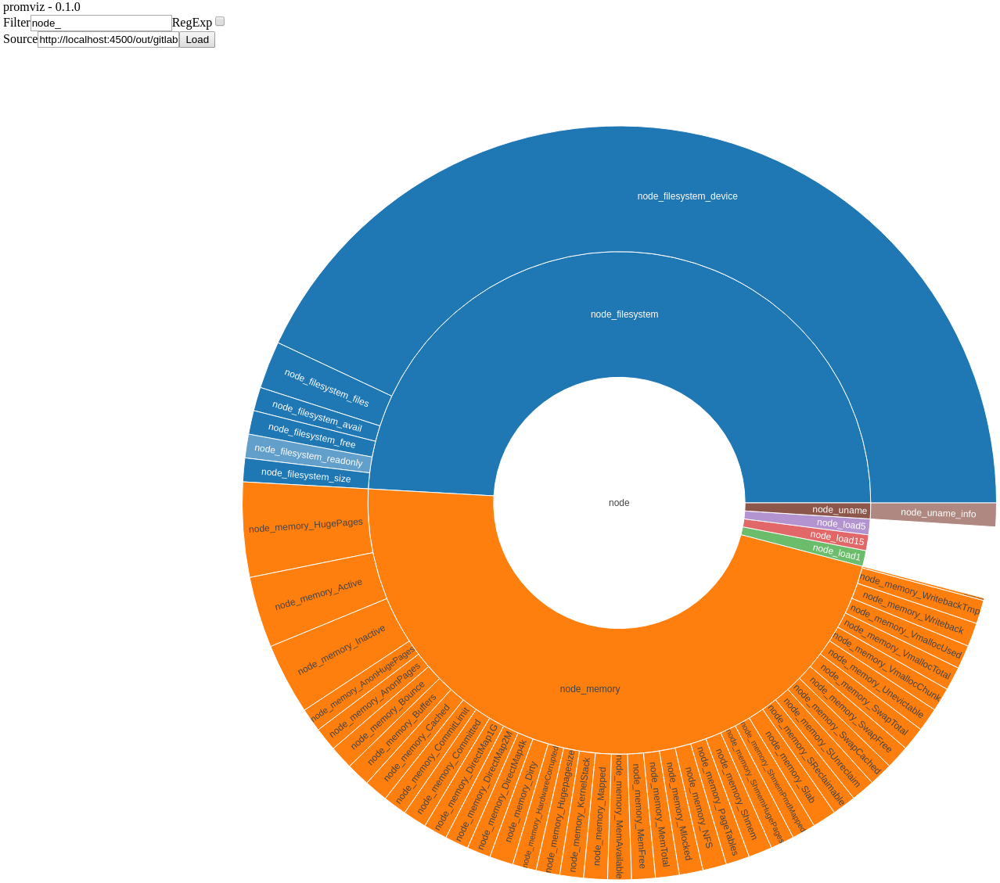

# promviz

Visualize Prometheus metrics as a tree, broken down by namespace and subsystem.

## Getting Started

- get some metric names
  - run `psql -f scripts/index-names.sql` against your [Prometheus SQL adapter database](https://github.com/ssube/prometheus-sql-adapter)
  - or use the included names from `src/resource/names.json`
- `make` the graph app
- serve `out/`:
  - `docker run --name promviz-nginx -p 4500:80 -v $(pwd):/usr/share/nginx/html:ro nginx`
  - or upload to CloudFront
- navigate to `out/index.html`
